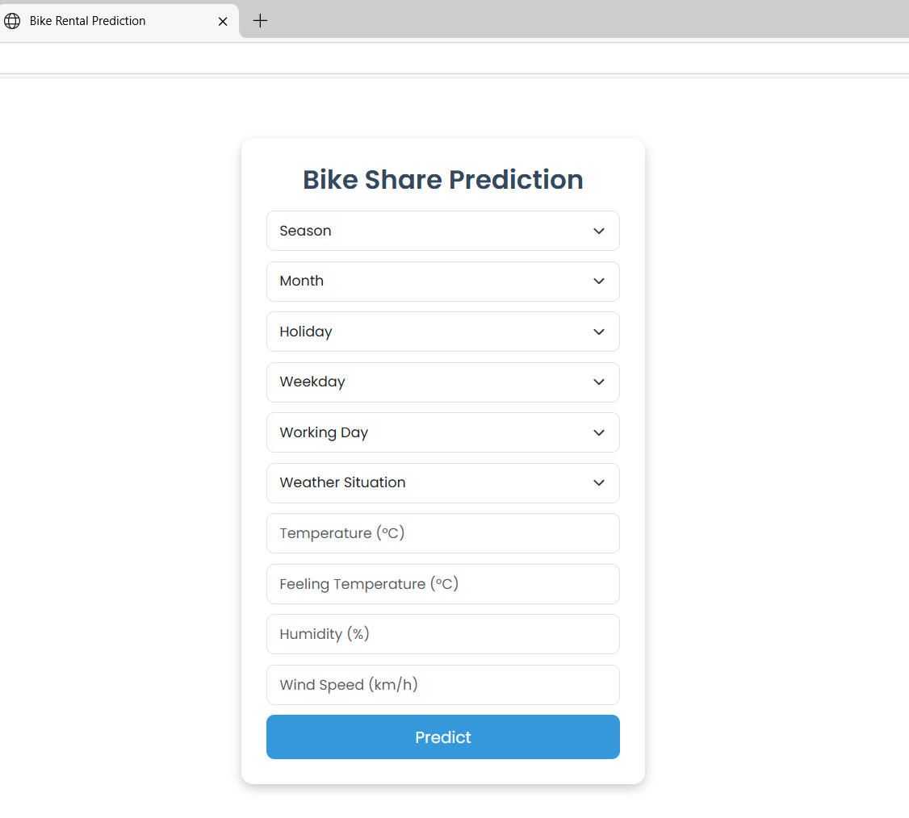

# Bike Share Demand Prediction ([Click-To-Use-App](https://bikerentalcicd-1.onrender.com))


## Introduction

Bike-sharing services generate vast amounts of data that can be analyzed to predict demand based on various factors like season, weather, and working days. This project uses **machine learning** to forecast bike rentals and provides an **API** to serve predictions. CICD (GitHub action) pipeline is utilized for test, build, and deployement to Render cloud.

## Project (web-app)


## Dataset

The dataset ([Download Here](https://your-dataset-link.com)) contains features such as:

- **dteday**: Date of rental.
- **season**: (1: Spring, 2: Summer, 3: Fall, 4: Winter).
- **yr**: Year (0: 2011, 1: 2012).
- **mnth**: Month (1-12).
- **holiday**: Is it a holiday? (0: No, 1: Yes).
- **weekday**: Day of the week (0: Sunday - 6: Saturday).
- **workingday**: Is it a working day? (0: No, 1: Yes).
- **weathersit**: (1: Clear, 2: Misty, 3: Light Rain/Snow, 4: Heavy Rain/Snow).
- **temp**: Normalized temperature.
- **atemp**: Normalized feeling temperature.
- **hum**: Normalized humidity.
- **windspeed**: Normalized wind speed.
- **rentals**: Number of bike rentals.

## Machine Learning Models

Several models were trained and evaluated:

- **Linear Regression**
- **Random Forest**
- **Gradient Boosting**
- **XGBoost**

The best-performing model is deployed via **Flask**.

## Model Training

Model training is detailed in `ml-implementation.ipynb`, covering:

- Data Preprocessing
- Feature Engineering
- Model Training & Evaluation
- Hyperparameter Tuning

## Deployment

- **Docker** is used to containerize the application, ensuring a consistent environment across deployments.  
- **GitHub Actions (CI/CD)** automates the deployment pipeline, testing and deploying the model whenever changes are pushed to the repository.  
- The application is hosted using **Render**.  

## API Endpoints

### `GET /`
Renders the home page.

### `POST /predict`
Accepts JSON input with feature values and returns predicted bike rentals.

## Running the Project Locally

### Prerequisites
Ensure you have **Docker** installed.

### Steps

```bash
# Clone the repository
git clone https://github.com/your-repo/bike-share-demand.git
cd bike-share-demand

# Build the Docker image
docker build -t bike-share-app .

# Run the container
docker run -p 8000:8000 bike-share-app

